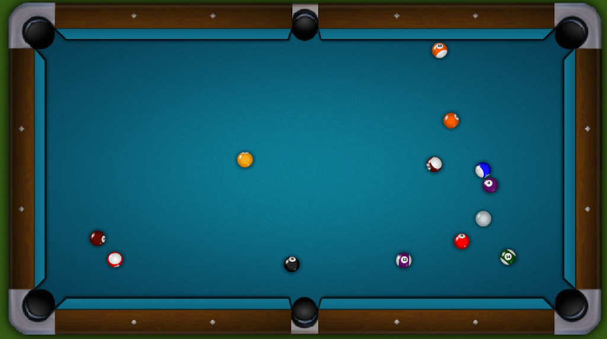
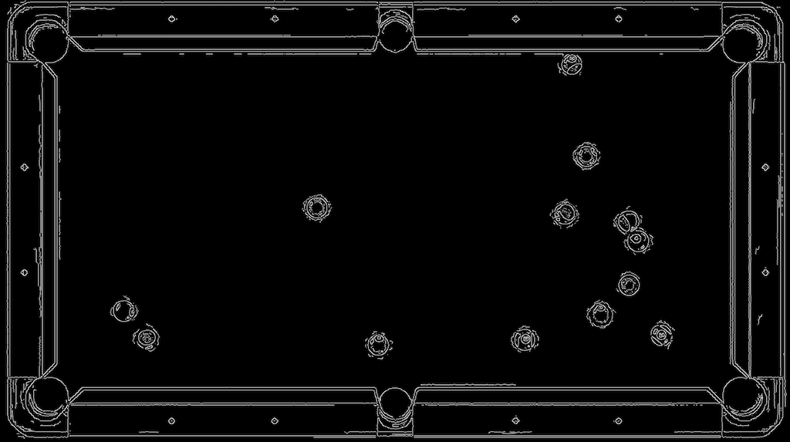

##### OpenCV installed using Homebrew
  * `brew install opencv3 --with-python3 --without-python`
  * note: change the name of the file in /usr/local/opt/opencv3/lib/python3.6/site-packages to cv2.so

##### TensorFlow installed using pip
  * `pip install tensorflow`

Run server.py with:  
`export FLASK_APP=server.py`    
`python -m flask run`.  
Visit localhost:5000/bd

Initial picture sent to the service

The result of canny edge detection on the previous image having already undergone
a 3x3 gaussian filter

Hough circle transform applied to the previous canny edge detection
results. The circles found are drawn on the first image for reference.

